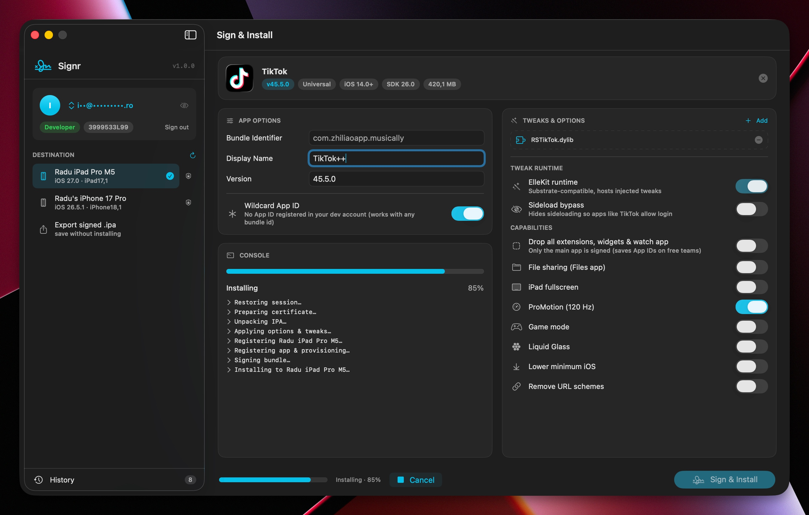

# Signr

A native macOS app that signs and sideloads iOS `.ipa` files using your Apple ID, a modern re-imagining of Cydia Impactor built with SwiftUI and a Rust signing core



## What it does

Signr does what Xcode does under the hood: it uses your Apple ID to request a development certificate and provisioning profile from Apple, re-signs the app (with optional tweaks and customizations), and installs it to a connected iPhone or iPad over USB or WiFi

Free Apple IDs work fine (7-day certs, up to 10 App IDs per week) and paid developer accounts unlock 1-year certificates with no weekly limits

## Features

- Apple ID sign-in with two-factor authentication (trusted device and SMS code)
- Account card with team picker showing your tier (Free 7-day, Personal, Developer) and team id, a Gravatar avatar, and an email privacy toggle
- Live USB and WiFi device detection with a trust/pair prompt and rich device info (iOS version, product type)
- Drag-and-drop IPA with automatic Info.plist fill (icon, version, SDK, min iOS, device family)
- Tweak, dylib and deb injection via drag-and-drop
- Tweak runtime section: ElleKit (Substrate-compatible, auto-managed) plus a Sideload bypass that hides sideloading so apps like TikTok allow login
- Wildcard App ID signing on paid teams: keeps the original bundle id and registers no per-app App ID in your developer account, matching the application-identifier other sideloaders produce so a signed app can install over theirs. Free teams append the team id and register an explicit App ID
- Optional "Drop all extensions, widgets & watch app" to sign only the main app
- Capability toggles: File Sharing, iPad fullscreen, ProMotion, Game Mode, Liquid Glass, lower minimum iOS, and URL scheme removal
- Live signing console with streaming progress
- Export a signed `.ipa` to disk via a Save panel
- Sign and install to a connected device over USB or WiFi

## Requirements

- macOS 26 (Apple Silicon)
- Xcode 26
- Rust (`brew install rust`)
- XcodeGen (`brew install xcodegen`)

## Build

```sh
./build.sh
open Signr.app
```

`build.sh` runs two steps you can also invoke separately:

1. `rust/build-xcframework.sh`: compiles `signr_core`, generates Swift bindings, and assembles `rust/build/signr_coreFFI.xcframework`
2. `xcodegen generate` + `xcodebuild`: generates the Xcode project from `project.yml` and builds the app

### Tests

```sh
xcodebuild -scheme Signr -destination 'platform=macOS,arch=arm64' test
```

## Using it

1. **Sign in**: click *Sign in with Apple ID* in the sidebar, enter your password, and type the 2FA code when prompted
2. **Connect a device**: plug in an iPhone or iPad over USB and tap *Trust* on the device when asked
3. **Sign & Install**: drag in an `.ipa`, pick the target device (or choose *Export signed .ipa*), adjust any options, and click *Sign & Install*

## Thanks

Signr started from [PlumeImpactor](https://github.com/claration/Impactor) as its base and iterated from there, building on and extending parts of its Rust signing core, with huge thanks to its authors for the groundwork

## License

MIT
